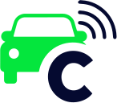

<!-- Improved compatibility of back to top link: See: https://github.com/othneildrew/Best-README-Template/pull/73 -->

<!-- PROJECT LOGO -->
 

  

  <h3 align="center">Car Secure WebSite</h3>

  

    An full website build with NextJS
     
    <a href="https://agenciabrasildigital.com.br/projetos/connect/">View Demo</a>
    ·
    <a href="mailto:yuutoandrew.jpn@gmail.com">Report Bug</a>
  

<!-- ABOUT THE PROJECT -->
## About The Project

[![Product Name Screen Shot][product-screenshot]](https://devandrew.com.br)

This website was created with the aim of accompanying the brand's new visual identity. I chose NextJS because of its speed and the SPA concept.

### Built With

* [![Next JS][Next.js]][Next-url]

<!-- CONTACT -->
## Contact

Andrew Augusto - [@Linkedin](https://www.linkedin.com/in/andrew-oliveira-734b191b1/) - Andrew Oliveira

(<a href="#readme-top">back to top</a>)

<!-- ACKNOWLEDGMENTS -->
## Acknowledgments

Some plus libs that i use in!

* [Framer Motion](https://www.framer.com/motion/)
* [Swiper JS](https://swiperjs.com/react)

<!-- MARKDOWN LINKS & IMAGES -->
[product-screenshot]: public/print_home.png
[Next.js]: https://img.shields.io/badge/Next-black?style=for-the-badge&logo=next.js&logoColor=white
[Next-url]: https://nextjs.org/